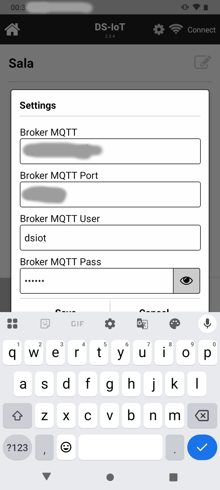
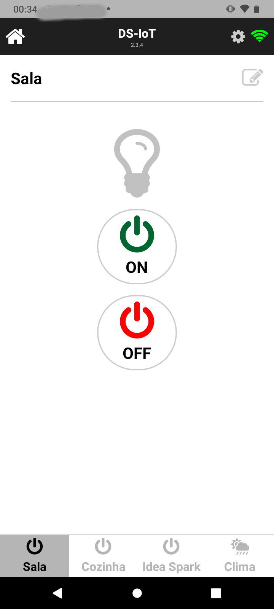
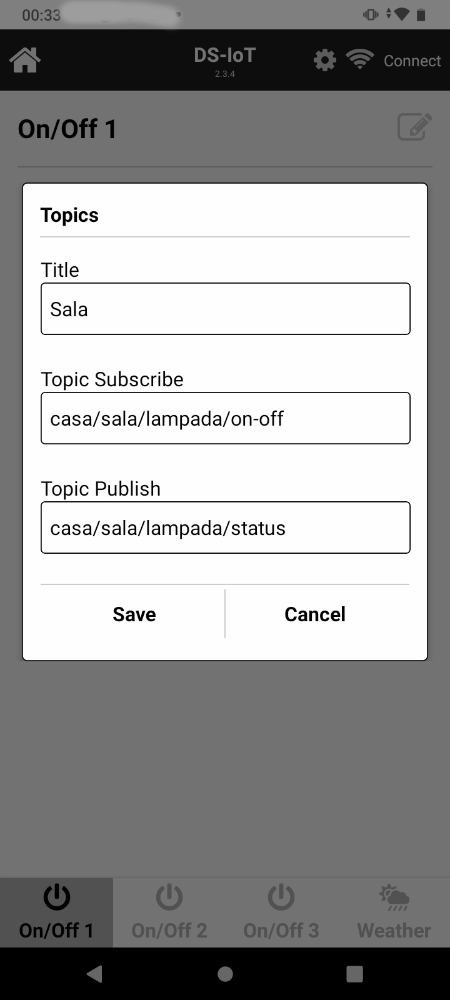
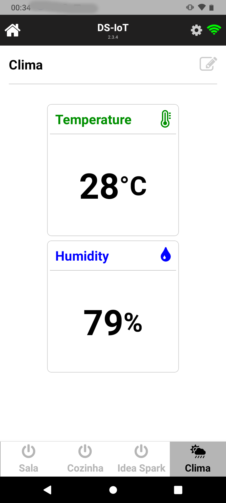

# 📱 Aplicativo IoT com React Native e MQTT

Este é um aplicativo desenvolvido em **React Native** voltado para **Internet das Coisas (IoT)**. Ele utiliza o protocolo **MQTT** para comunicação com dispositivos físicos e oferece controle de **cargas elétricas** além da exibição de dados de **sensores DHT (temperatura e umidade)**.

---

## 🔧 Funcionalidades

- 📶 Conexão com broker MQTT (local ou externo)
- 🔌 Acionamento remoto de cargas (ex: lâmpadas, ventiladores)
- 🌡️ Leitura em tempo real de sensores DHT (temperatura e umidade)
- 📲 Interface móvel leve, responsiva e intuitiva
- 🔐 Configurações de broker e tópicos personalizáveis


📦 **Download do APK**  
[Baixar APK](https://expo.dev/artifacts/eas/tc1YVbZJnP4co1gXqqtZUt.apk)


## 🔧 Comando enviado e recebido pela a aplicação

As telas **ON/OFF** enviam no payload do tópico publish os texto **"on"** e **"off"**, ou seja, a lógica do firmware do seu microcontrolador dever tratar devidamente o recebimento desses textos.

A tela do **DHT/Clima** recebe o payload no formato JSON abaixo:

```json
{
  "temp": 25.3,
  "humi": 62.1
}

```

A lógica do firmware do seu microcontrolador deve enviar o dado nesse formato. 


## 🖼️ Imagens da Aplicação







